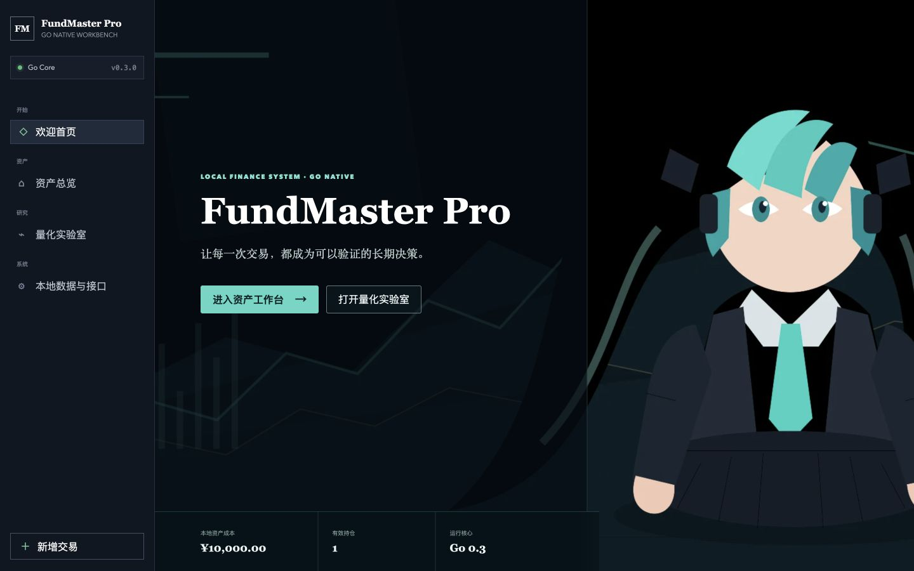
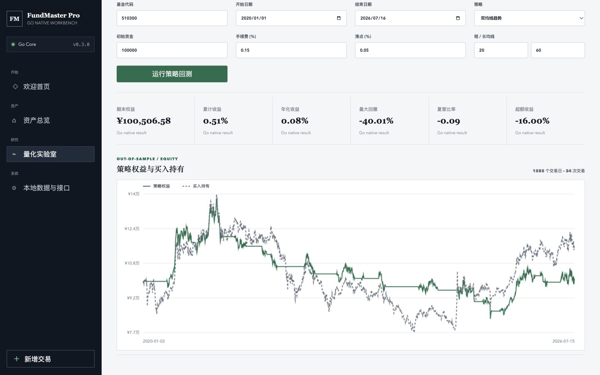
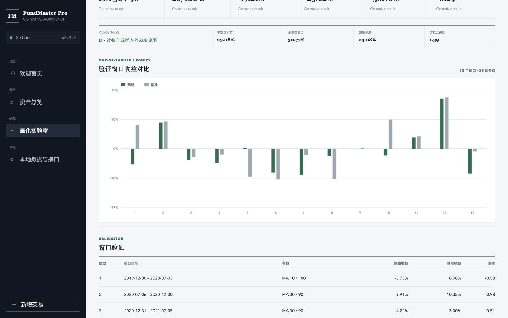
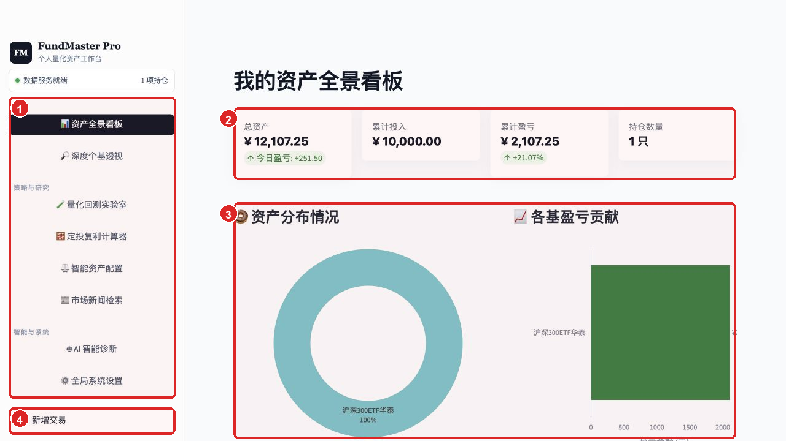
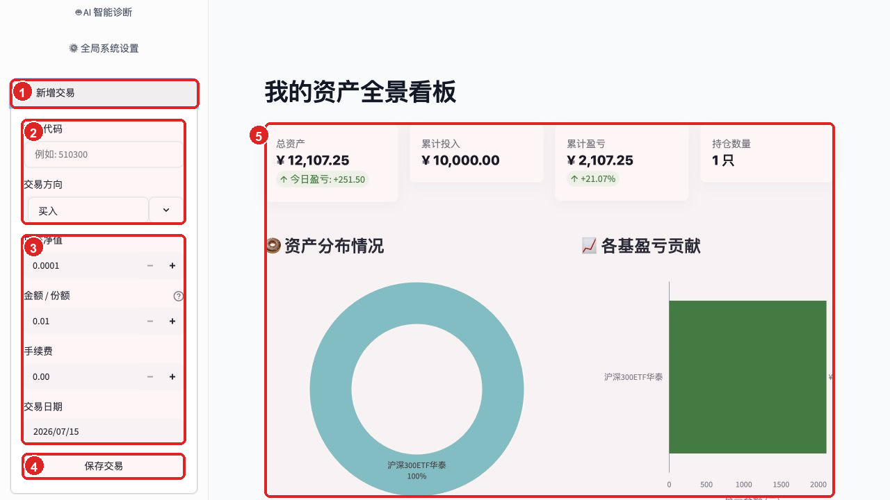
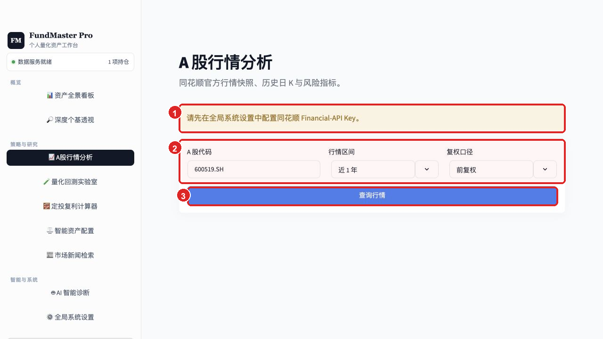
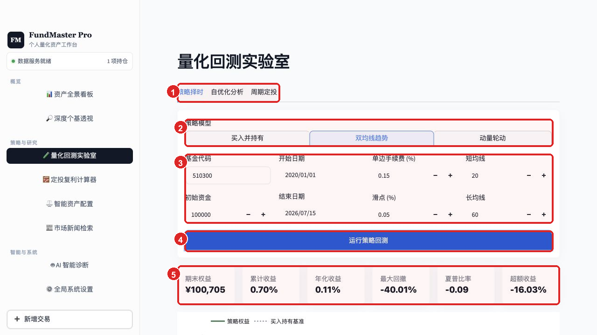
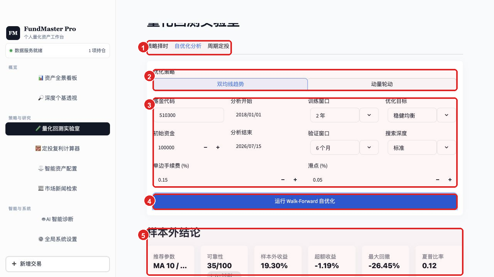
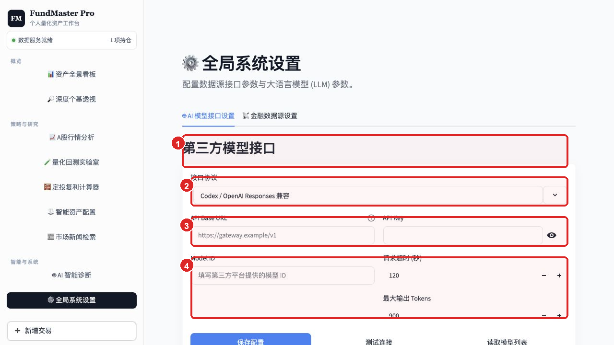

# FundMaster Pro 产品解析与操作指南

> 本文已更新至 2026-07-16 的 `0.3.0` Go 版本。第 2 节使用当前 Go 界面实测截图；后续带标注截图来自 `0.2.x` 兼容界面，用于说明尚在迁移中的扩展工作流。截图中的资产、回测和模型参数均为演示数据，历史结果不构成投资建议。

## 1. 产品定位

FundMaster Pro 是一个面向个人投资者的基金与 A 股研究工作台。它把持仓记账、行情研究、策略回测、参数优化、资产配置、新闻检索和第三方大模型诊断放在同一个界面中，核心目标不是直接给出“买卖答案”，而是让一项判断可以被数据验证、被成本约束，并能看到样本外风险。

`0.3.0` 将默认运行时切换为 Go 单二进制。当前 Go 工作台覆盖欢迎首页、资产流水、基金回测、Walk-Forward、本地备份和模型网关配置；A 股、新闻和完整模型诊断仍保留在 Python `0.2.x` 兼容实现中，后续逐步迁移。

## Go 0.3.0 当前界面

### 默认欢迎首页



1. **默认入口**：启动后先显示 FundMaster Pro 欢迎页，不直接把用户放进数据表格。
2. **本地摘要**：底部半透明状态带读取真实 SQLite 持仓成本和有效持仓数。
3. **两条主路径**：“进入资产工作台”用于记账和持仓，“打开量化实验室”直接进入研究。
4. **本地视觉资源**：青绿色双马尾虚拟歌姬背景以 WebP 嵌入 Go 二进制，不依赖 CDN 或运行时图片请求。

### 真实基金回测



1. **统一假设区**：基金、日期、资金、成本和参数在运行前集中确认。
2. **结果摘要**：收益、回撤、夏普和超额收益使用同一口径排列。
3. **可读坐标轴**：权益图补充金额刻度、起止日期、策略与买入持有图例。
4. **本次实测**：510300 从 2020 年开始共 1,585 个价格点、34 次交易，累计收益约 `0.51%`，最大回撤约 `-40.01%`，超额收益约 `-16.00%`。

### Walk-Forward 自优化诊断



1. **诊断条**：可靠性结论、参数稳定性、正收益窗口、跑赢基准和过拟合差距并排展示。
2. **窗口对比**：每个验证窗口同时绘制策略与基准收益，负收益不会被隐藏。
3. **严格样本外汇总**：各窗口日收益按时间串联，再统一计算收益、回撤、波动和夏普。
4. **本次实测**：13 个验证窗口、29 组参数，最终评级为 `D`，界面明确提示“过拟合或样本外表现偏弱”。

Go 版桌面使用固定侧边栏；`760px` 以下切换为底部导航，并将新增交易作为第 5 个独立动作。移动端成本金额保持单行，图表图例会根据窄画布收紧坐标。

| 用户问题 | 对应模块 | 主要输出 |
| --- | --- | --- |
| 我的资产现在怎么样？ | 资产全景看板 | 总资产、投入、盈亏、持仓结构与贡献 |
| 一只基金或股票发生了什么？ | 深度个基透视、A 股行情分析 | 行情、收益风险、持仓贡献与基本研究 |
| 一个交易规则历史上是否有效？ | 量化回测实验室 | 权益曲线、回撤、夏普、超额收益与交易记录 |
| 最优参数是否只是过拟合？ | 自优化分析 | 样本外收益、稳定性、验证窗口与可靠性评级 |
| 长期投入可能形成多少资产？ | 定投复利计算器 | 投入、终值、收益与复利轨迹 |
| 如何分散风险？ | 智能资产配置 | 约束下的组合权重与风险收益 |
| 外部信息和模型怎么看？ | 新闻检索、AI 智能诊断 | 新闻线索与第三方模型分析 |

## 2. 信息架构

侧边栏按任务而不是按技术能力分为三组：

- **概览**：资产全景与单基金透视，回答“现在发生了什么”。
- **策略与研究**：A 股分析、回测、定投、配置和新闻，回答“规则是否成立、接下来如何研究”。
- **智能与系统**：AI 诊断和接口设置，负责外部能力与系统参数。
- **新增交易**：固定在侧边栏底部，作为高频记账入口，不占用研究页面空间。

## 3. 操作一：查看资产全景



1. **分组导航**：当前页面使用深色选中态；研究、智能和设置入口在空间上明确分组，降低模块较多时的寻找成本。
2. **资产摘要**：先读总资产、累计投入、累计盈亏和持仓数量。绿色变化值表达正向结果，金额与比例分层展示。
3. **结构与贡献**：环图回答“钱分布在哪里”，贡献图回答“谁带来了盈亏”。两者并列比单独展示收益率更利于诊断集中度风险。
4. **新增交易**：随时录入买入或卖出，保存后资产看板重新聚合；这是持仓数据进入整个分析链路的起点。

产品判断：Go `0.3.0` 已将独立欢迎页设为默认首页；资产页仍保持“总量 -> 结构 -> 明细”的信息顺序。当持仓增加后，建议优先观察集中度和单只基金贡献，而不是只看当日盈亏。

## 4. 操作二：录入一笔交易



1. **展开交易入口**：新增交易固定在侧边栏底部，展开后不会离开当前分析页面。
2. **确认标的和方向**：填写基金代码并选择买入或卖出。买入和卖出共用一张表单，但数量字段的含义不同。
3. **填写成交信息**：买入时“金额 / 份额”填写投入金额，卖出时填写卖出份额；成交净值、手续费和日期共同决定实际成本与持仓数量。
4. **保存交易**：提交前检查代码、方向和数量。保存成功后，系统重新聚合持仓，不需要手动刷新资产页面。
5. **检查聚合结果**：资产摘要、分布图、盈亏贡献和详细持仓都会使用最新交易记录重新计算。

交易记录是资产分析的事实来源。为了保证累计投入和收益率可追溯，不建议直接修改聚合后的持仓结果；发生录入错误时，应通过对应的更正交易或数据维护流程修正原始记录。

## 5. 操作三：查询 A 股行情



1. **配置前置条件**：页面会明确提示是否已经配置同花顺 Financial-API Key。没有凭据时仍可检查查询参数，但不会发送无效请求。
2. **定义查询口径**：填写标准 A 股代码，并选择近 3 个月、近 1 年或近 3 年，以及前复权、不复权或后复权。跨时间比较通常使用前复权，核对历史实际价格时再选择不复权。
3. **查询行情**：系统同时读取最新行情快照和历史日 K。成功后展示最新价、区间收益、最大回撤、年化波动、当日最高价、成交额、K 线、MA20、MA60 和成交量。

行情分析页解决“这只股票最近怎么走”，基金透视中的持仓贡献解决“已披露股票对基金可能产生了什么影响”。两者的数据口径不同，不能把季度披露持仓当成基金的实时完整仓位。

## 6. 操作四：运行策略回测



1. **研究视图切换**：策略择时、自优化分析和周期定投共享一个实验室，三者对应单参数验证、滚动优化和长期投入三种不同问题。
2. **策略模型**：可在买入持有、双均线趋势和动量轮动之间切换。买入持有也是其他策略的基准。
3. **回测假设**：设置基金代码、日期、资金、手续费、滑点和策略参数。手续费与滑点会在仓位变化及最终平仓时计入。
4. **执行入口**：点击“运行策略回测”后才进行数据加载和计算，便于先完整检查假设。
5. **结果摘要**：先比较累计收益、最大回撤、夏普和超额收益，再查看下方策略权益与买入持有曲线。截图中的双均线结果超额收益为负，说明降低波动或择时并不等于跑赢基准。

回测规则使用收盘数据生成信号，并延迟一个交易日生效，避免用当日收盘价产生信号后又假设按同一收盘价成交。当前执行模型是全仓或空仓，不支持做空。

## 7. 操作五：运行 Walk-Forward 自优化



1. **进入自优化分析**：它与普通回测分开，避免把“训练期最优参数”误认为可直接交易的结论。
2. **选择策略族**：目前支持双均线和动量策略的参数搜索；买入持有作为样本外基准，不参与优化。
3. **定义实验**：训练窗口用于选参数，验证窗口只负责评估；还可选择稳健均衡、夏普优先或收益优先，以及快速、标准、深入三种搜索深度。
4. **启动滚动验证**：系统按时间向前滚动，每一折只使用当时已经发生的历史数据选择参数，然后在紧随其后的未见数据上验证。
5. **阅读样本外结论**：推荐参数只是结果之一，可靠性、样本外收益、超额收益、最大回撤和夏普必须一起看。

截图中的默认实验推荐 `MA 10 / 40`，样本外收益为 `19.30%`，但超额收益为 `-1.19%`、最大回撤为 `-26.45%`，可靠性仅 `35/100（D）`。产品因此给出“过拟合或样本外表现偏弱”的结论，而不是把推荐参数包装成确定性信号。

自优化诊断还包括：

| 指标 | 解释 |
| --- | --- |
| 参数稳定度 | 同一参数在多个验证窗口中被选中的比例 |
| 正收益窗口 | 样本外验证收益大于零的窗口比例 |
| 跑赢基准窗口 | 样本外收益超过买入持有的窗口比例 |
| 训练-验证差距 | 训练表现与验证表现之间的落差，越大越需要警惕过拟合 |
| 可靠性评级 | 将稳定性、样本外表现和过拟合差距合并为 A-D 级判断 |

## 8. 操作六：接入第三方模型



1. **第三方模型区**：AI 模型接口与金融数据源设置分成两个标签，避免把行情凭据和大模型凭据混在一起。
2. **接口协议**：根据网关能力选择 Codex / OpenAI Responses、Anthropic Messages 或 OpenAI Chat 兼容协议。
3. **连接凭据**：填写 API Base URL 与 API Key。Key 使用密码输入框，保存到本机私有 SQLite 数据库，不写入仓库。
4. **模型和限制**：填写 Model ID，并设置请求超时与最大输出 Tokens。超时控制失败等待时间，Tokens 控制响应长度和潜在成本。

推荐操作顺序是：填写协议和连接信息 -> 读取模型列表或手动填写 Model ID -> 测试连接 -> 保存配置 -> 前往 AI 智能诊断。截图和本文都不会记录真实 API Key。

## 9. 当前量化策略

| 策略 | 入场规则 | 离场规则 | 适用角色 |
| --- | --- | --- | --- |
| 买入并持有 | 首日持有 | 回测结束平仓 | 基准，判断主动规则是否真正增加价值 |
| 双均线趋势 | 短期均线高于长期均线 | 短期均线不再高于长期均线 | 捕捉中期趋势，震荡期可能频繁失效 |
| 动量轮动 | N 日收益超过阈值 | N 日收益回落至阈值以下 | 捕捉持续上涨，参数对市场状态较敏感 |

所有策略统一计算手续费、滑点、最终平仓成本、回撤、夏普、胜率、持仓暴露和相对买入持有的超额收益，因此不同策略之间可以在相同口径下比较。

## 10. 从数据到决策的推荐路径

一套完整分析应当按以下顺序进行：

1. **建立事实数据**：录入交易并在资产看板核对投入、持仓数量和盈亏。
2. **检查标的状态**：通过基金透视、A 股行情和新闻检索了解价格、风险及事件背景。
3. **提出可验证规则**：把“趋势向上”“动量较强”等判断转换成双均线或动量参数，而不是直接依赖主观描述。
4. **运行含成本回测**：先确认规则在历史上的收益、回撤、交易次数和相对基准表现。
5. **进行样本外验证**：使用 Walk-Forward 检查参数稳定性和过拟合差距，低可靠性结果不进入候选策略池。
6. **形成组合约束**：结合资产配置控制单一基金或行业暴露，避免单策略结果直接决定全部仓位。
7. **使用 AI 辅助复核**：让第三方模型整理证据、风险和反例，但保留行情时间、输入数据和模型配置作为审计上下文。

产品的核心闭环可以概括为：`交易记录 -> 资产状态 -> 标的研究 -> 规则回测 -> 样本外验证 -> 组合约束 -> 复盘`。任何一步数据不足，都应回到前一步补充证据，而不是跳到买卖结论。

## 11. 产品优势与下一步优化

当前版本的优势：

- 导航按投资工作流分组，首页信息密度适中，高频交易录入始终可达。
- 回测明确展示成本、基准和回撤，不只展示累计收益。
- Walk-Forward 使用严格的时间顺序和样本外验证，允许结果为负，也会明确给出低可靠性评级。
- 第三方模型接口可替换，Key 不进入源码或 Git，模型能力与金融分析模块保持解耦。

建议优先继续优化：

- 为每次回测生成可保存的实验记录，支持两组策略并排比较和复现。
- 在结果顶部显示数据来源、最后更新时间和是否使用缓存，降低用户对行情时效性的误解。
- 将可靠性评级设置为策略进入“候选池”的门槛，而不是直接转换为交易指令。
- 增加组合级 Walk-Forward 和再平衡约束，避免单基金结果被误用到多资产配置。
- 为模型诊断增加引用数据时间、输入摘要和费用估算，使 AI 输出更容易审计。

## 12. 本地数据长期保存

`0.2.0` 开始，交易流水、模型配置、基金数据源配置和 A 股接口配置统一保存在 `data/fundmaster.db`。持仓属于交易流水的派生结果，每次读取时重新构建，因此不会出现“交易记录和持仓汇总分别保存、长期逐渐不一致”的问题。

长期保存机制包括：

- 首次启动自动迁移旧 `data/portfolio.json`，迁移前保留原始 JSON 备份。
- SQLite 事务保证单笔交易和配置更新原子写入，异常中断不会留下半条记录。
- 应用启动时按 24 小时间隔自动备份，也可在设置页点击“立即备份数据库”。
- 完整备份包含本机保存的接口凭据；“导出持仓 JSON”明确排除所有 API Key。
- macOS/Linux 下数据库、WAL 文件和备份权限限制为当前用户读写。

建议将 `data/backups/` 定期同步到个人加密磁盘或受控云盘。恢复前停止应用，用备份文件替换当前数据库，并保留被替换文件以便回退。

## 13. 本地运行

```bash
mkdir -p dist
GOCACHE=/tmp/fundmaster-go-cache CGO_ENABLED=1 go build \
  -trimpath -ldflags="-s -w" \
  -o dist/fundmaster-go-darwin-arm64 ./cmd/fundmaster
./dist/fundmaster-go-darwin-arm64 serve
```

默认地址为 `http://127.0.0.1:8503/`，可通过 `-addr` 或 `FUNDMASTER_ADDR` 覆盖。备份可以直接从 Go 命令执行：

```bash
./dist/fundmaster-go-darwin-arm64 backup
./dist/fundmaster-go-darwin-arm64 version
```

Python `0.2.x` 旧版只在需要尚未迁移的 A 股、新闻或完整模型分析时使用：

```bash
source venv/bin/activate
streamlit run src/ui/app.py
```
